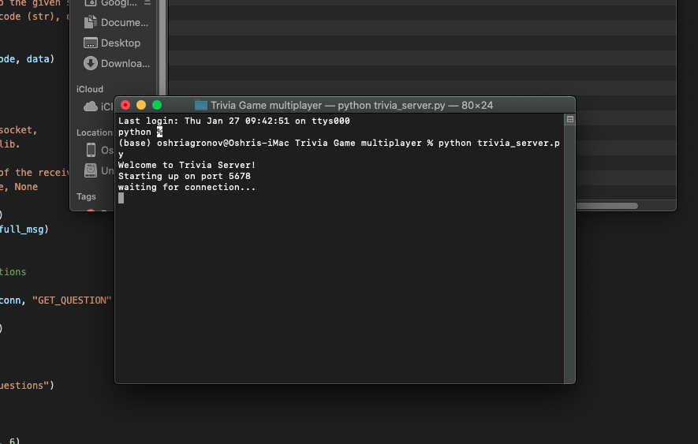
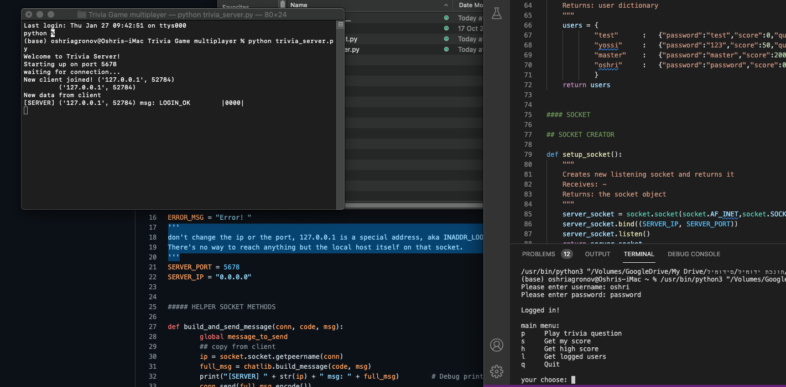

<br />
<div align="center">
  <a href="https://github.com/oshriagronov/trivia-game">
    
  </a>

<h3 align="center">Trivia Game</h3>
  <p align="center">
    Simple CLI trivia game running locally with a database.
  </p>
</div>

## About
The server features a scoring system for friendly competition and maintains separate databases for users and questions.
<br/>An administrator can manage users and add new questions to the database.

### Key features

- The client and server communicate using the TCP protocol.
- A user database is stored as a dictionary. Each user entry is another dictionary containing their password, score, and the number of questions asked.
- An admin can add questions to a separate question database, which is also a dictionary.
- A custom library is used to build messages with the correct protocol structure.
- The game has score system
	
## Technologies Used
- python.
- socket: A library for setting up a local server and managing message exchange between the server and a client's IP address.
- select: This library notifies the program when a connection is ready to be read from, written to, or has an exception.
- time: A library used to create delays, which helps ensure users have time to read messages.
- chatlib: A custom library containing all the functions needed to ensure client and server messages follow the specified communication protocol.

## Media
> server booting.


> Example of process of game.



## Getting Started

To get a local copy up and running follow these simple steps.

### Prerequisites

- Linux, MacOS or Windows
- python

### Installation

---

1. **Clone and enter the trivia-game repository:**

   ```bash
   git clone https://github.com/oshriagronov/trivia-game && cd trivia-game
   ```

2. **Open two seprate terminals/cmd windows an run:**
	<br/> first run:
   ```bash
   python trivia_server.py
   ```
   second:
   ```bash
   python trivia_client.py
   ```

4. **Play!**  

### Known issues
* If you close the server and run it immediately then it will give you error that the port or the ip already catch so you need to wait a while and then it will work

## Acknowledgements
I would like to thank CampusIL and the team behind the Network.py course.
> Link to the course home page [here](https://campus.gov.il/course/cs-gov-cs-networkpy103-2020-1/)
