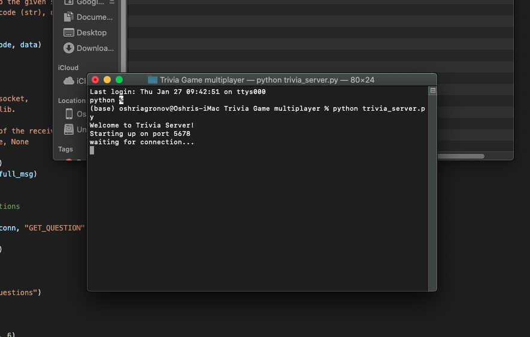
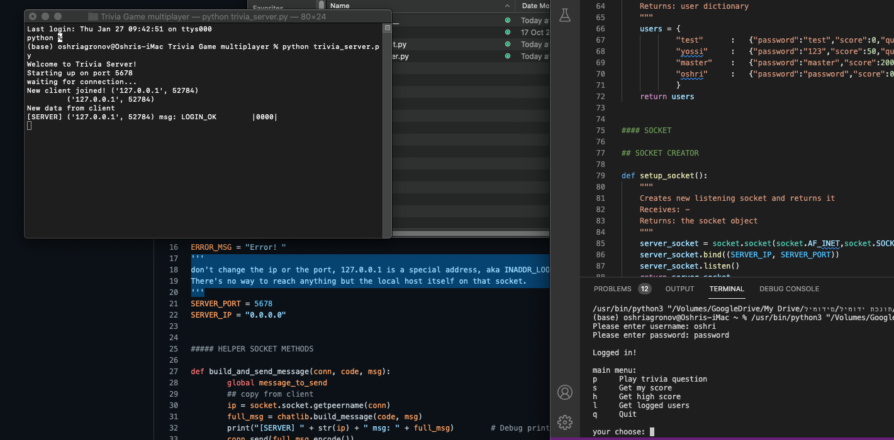

# Trivia Game(server based) - Written in python
[](https://www.python.org/)[](https://svgshare.com/i/Zhy.svg)[](https://svgshare.com/i/ZjP.svg)[](https://svgshare.com/i/ZhY.svg)
> The project is basically a trivia game running by a server, with users database and questions database😄
## Table of contents
* [General info](#general-info)
* [Technologies](#technologies)
* [Features](#features)
* [Screenshots](#screenshots)
* [Setup](#setup)
* [Project Status](#project-status)
* [Acknowledgements](#acknowledgements)
* [Contact](#contact)

## General info
- The server have a score system so you can compete with your friends to see who have higher score :smile:
- The server have database of users, you(the admin) can add and remove users from the database.
- The server have a quetion database, at the moment the database has only two questions, because i didn't need more than that for the server testing but you can add more!
	
## Technologies
Project is created with:
* python version: 3.9 .
* visual studio code.
* socket - Library used to setup local server and to send messages bettwen the server with ip address to the client and back.
* select - The library tells the kernel to notify when any of the descriptors in the sets are ready for read/write/exception conditions.
* time - library used to create a delay so the user could see the messages.
* chatlib - A custom library that have all the functions that make the client and server messages correct according to the protocol we maked.

## Features
- The server and the client use tcp protocol to communicate.
-  You have dictionary database of users and for every user you have a dictionary inside that dictionary, and inside there: password, score, number of questions asked.
- You have dictionary database of question you can expand as much as you want.
- A custom library that responsibility for building messages with correct structure according to the protocol.

## Screenshots
> server booting.




> Example to process of game.



## Setup
* First of all you need to install python on your computer and write your ip in both server and client script.
1. Download all the files.
2. Open two cmd/terminal windows.
3. In one of them we run server script:
```
$ cd ../"The folder you download the flies"
$ python trivia_server.py
```
4. And in the other one we run the client script: 
```
$ cd ../"The folder you download the flies"
$ python trivia_client.py
```
## Project Status
The project is completed but no longer get updated, because it was part of a course i took, and i moved on to other courses to expand my knowledge ⚡

### Known issues
* if you close the server and run it immediately then it will give you error that the port or the ip already catch so you need to wait a while and then it will work

## Acknowledgements
I would want to thank CampusIL and the team behind the Network.py course!
> Link to the course home page [here](https://campus.gov.il/course/cs-gov-cs-networkpy103-2020-1/)

## Contact
Created by Oshri Agronov, feel free to contact me:v:
